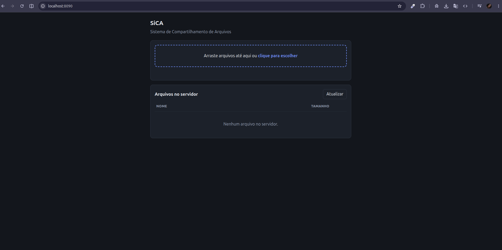
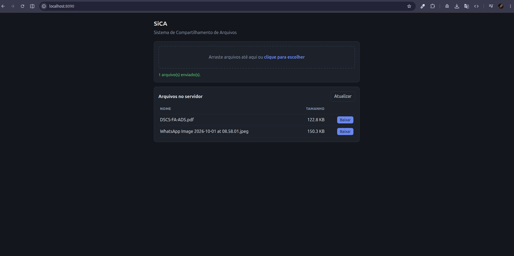
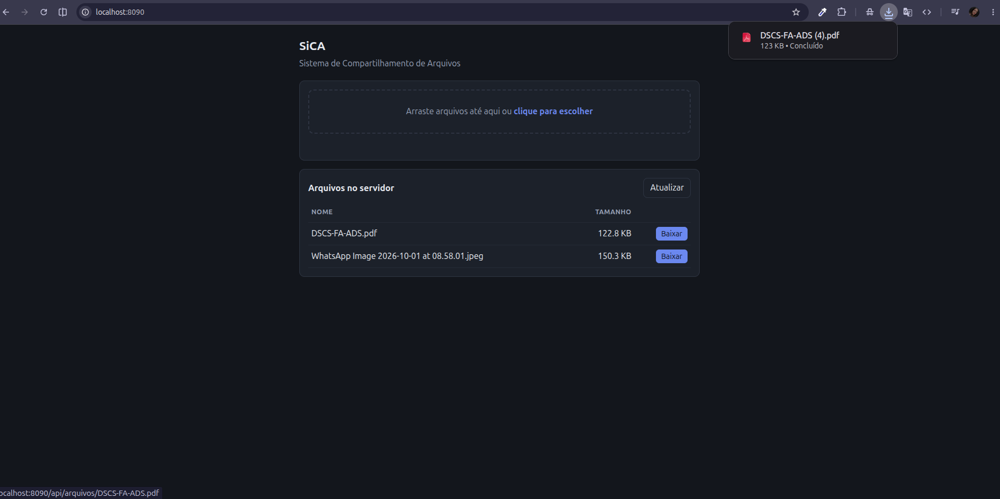

# SiCA — Sistema de Compartilhamento de Arquivos

Aplicação cliente/servidor em Java (somente biblioteca padrão, sockets TCP) que permite
**enviar**, **listar** e **baixar** arquivos guardados em um servidor. Há dois clientes: um de
**console** e uma **interface web** no navegador.

```
 Cliente (console) ───────────────TCP───────────────┐
                                                     ▼
 Navegador ──HTTP──▶ ServidorWeb ──────TCP──────▶ Servidor ──▶ pasta de arquivos
```

## Sumário

1. [Arquivos do projeto](#arquivos-do-projeto)
2. [Como executar](#como-executar)
3. [Como funciona](#como-funciona) — protocolo TCP, interface web e decisões de projeto
4. [Como testar](#como-testar) — roteiro passo a passo, com saídas esperadas
5. [Resultados dos testes](#resultados-dos-testes)

## Arquivos do projeto

| Arquivo | Papel |
|---|---|
| `Cliente-Servidor/Servidor.java` | Aceita conexões e atende os comandos dos clientes (uma thread por cliente). |
| `Cliente-Servidor/Cliente.java` | Cliente de console: menu que conversa com o servidor. |
| `Cliente-Servidor/ServidorWeb.java` | Interface web: serve a página e traduz requisições HTTP em comandos do protocolo TCP. |
| `Cliente-Servidor/web/index.html` | Página da interface web (HTML + JavaScript puro, sem dependências externas). |
| `Cliente-Servidor/Protocolo.java` | Constantes do protocolo e funções usadas por todos (validação de nome, cópia de bytes, status OK/ERRO). |
| `docs/imagens/` | Capturas de tela usadas neste README. |

## Como executar

**Pré-requisito:** Java 8 ou superior (JDK, não só o JRE). Confira com `java -version` e
`javac -version`. No Ubuntu/Debian: `sudo apt install default-jdk`.

Todos os comandos abaixo são executados dentro de `Cliente-Servidor/`:

```bash
cd Cliente-Servidor
javac *.java

# Terminal 1 — servidor (porta e pasta opcionais; padrões: 5000 e ./arquivos_servidor)
java Servidor [porta] [pasta]

# Terminal 2 — cliente de console (padrões: localhost, 5000 e ./downloads)
java Cliente [host] [porta] [pasta_de_downloads]

# Terminal 3 (opcional) — interface web; depois abra http://localhost:8090
java ServidorWeb [portaHttp] [hostSica] [portaSica]    # padrões: 8090, localhost e 5000
```

O `ServidorWeb` precisa ser iniciado de dentro de `Cliente-Servidor/` (ele lê `web/index.html`
da pasta atual) e com o `Servidor` já no ar. Ele pode apontar para um servidor SiCA em outra
máquina, passando `hostSica` e `portaSica`.

Menu do cliente de console:

```
1) Listar arquivos do servidor
2) Enviar arquivo        -> pede o caminho do arquivo local
3) Baixar arquivo        -> pede o nome (como aparece na listagem)
0) Sair
```

> **Atenção:** sem argumentos, o servidor cria `arquivos_servidor/` e o cliente cria `downloads/`
> dentro de `Cliente-Servidor/`, e o `javac` gera arquivos `.class` ali. Não faça commit desses
> itens (nem dos arquivos que você enviar nos testes). O roteiro de testes abaixo usa pastas em
> `/tmp/sica/` justamente para não sujar o repositório.

## Como funciona

1. O **servidor** cria um `ServerSocket` na porta escolhida e fica em `accept()`. A cada conexão,
   entrega o socket a uma thread (`AtendimentoCliente`), de modo que vários clientes são atendidos
   ao mesmo tempo.
2. O **cliente de console** abre um `Socket` para o servidor e mantém **uma única conexão durante
   toda a sessão**, enviando um comando por vez.
3. Toda mensagem usa `DataInputStream`/`DataOutputStream`: textos em UTF, inteiros e longos em
   formato fixo. O cliente envia um **comando**; o servidor responde com `OK` (mais os dados do
   comando) ou `ERRO` + motivo.

### Protocolo TCP

```
LISTAR   C→S: "LISTAR"
         S→C: "OK", int quantidade, { UTF nome, long tamanho } * quantidade

ENVIAR   C→S: "ENVIAR", UTF nome, long tamanho
         S→C: "OK"  (nome aceito)                      ou "ERRO", UTF motivo
         C→S: <tamanho> bytes do arquivo
         S→C: "OK"  (arquivo gravado)

BAIXAR   C→S: "BAIXAR", UTF nome
         S→C: "OK", long tamanho, <tamanho> bytes      ou "ERRO", UTF motivo

SAIR     C→S: "SAIR"   (servidor fecha a conexão)
```

O **tamanho vem antes dos bytes**. Assim quem recebe sabe exatamente onde o arquivo termina e a
mesma conexão pode ser reutilizada para o próximo comando. Os bytes são copiados em blocos de 8 KiB,
então arquivos grandes não precisam caber na memória, e qualquer tipo de arquivo (texto ou binário)
é transferido sem alteração.

No `ENVIAR`, o servidor responde `OK` *antes* de o cliente mandar os bytes: se o nome for inválido,
o erro é informado sem desperdiçar a transferência.

### Interface web

O `ServidorWeb` é uma **ponte**: não guarda nem processa arquivos por conta própria. Para cada
requisição HTTP do navegador, abre uma conexão TCP com o `Servidor` e fala o protocolo acima,
repassando os bytes direto de um lado ao outro (sem carregar o arquivo inteiro na memória). Assim
a regra de armazenamento fica em um só lugar e a interface web funciona com o mesmo servidor
que o cliente de console. Usa o servidor HTTP embutido no JDK (`com.sun.net.httpserver`).

| Requisição HTTP | Ação | Comando SiCA |
|---|---|---|
| `GET /` | página HTML | — |
| `GET /api/arquivos` | lista em JSON: `[{"nome":"...","tamanho":123}]` | `LISTAR` |
| `GET /api/arquivos/{nome}` | baixa o arquivo | `BAIXAR` |
| `PUT /api/arquivos/{nome}` | envia um arquivo (o corpo é o próprio arquivo) | `ENVIAR` |

Erros voltam com o status HTTP adequado e o corpo `{"erro":"mensagem"}`: `400` nome inválido,
`404` arquivo inexistente, `411` envio sem `Content-Length`, `405` método não permitido e
`502` servidor SiCA fora do ar. O envio usa `PUT` (e não `POST`) para que outro site aberto no
navegador não consiga disparar uploads para cá sem permissão (CORS).

Na página, a lista de arquivos aparece com um botão **Baixar** em cada linha. Para enviar,
arraste arquivos para a área tracejada ou clique nela (vários de uma vez, com barra de progresso;
se o nome já existir, a página pergunta antes de substituir). O botão **Atualizar** relê a lista.

### Decisões de projeto

- **Upload/download atômicos:** os bytes são recebidos em um arquivo temporário (`.upload-*.tmp` no
  servidor, `.download-*.tmp` no cliente de console) e só são renomeados para o nome final quando
  completos. Uma conexão que caia no meio não deixa arquivo pela metade nem aparece na listagem.
- **Segurança do nome do arquivo:** nomes com `/`, `\`, vazios ou iniciados por `.` são recusados
  (`Protocolo.nomeValido`), tanto pelo servidor quanto pelos clientes. Isso impede pedidos como
  `../../etc/passwd` (*path traversal*) e esconde os temporários. O cliente só envia o nome do
  arquivo, nunca o caminho local.
- **Nome repetido:** enviar um arquivo com nome já existente no servidor o **substitui**; o mesmo vale
  para baixar um arquivo para uma pasta que já o contenha.
- **Erros:** erros do usuário (arquivo inexistente, nome inválido) são mostrados e o menu continua;
  erros de rede encerram a sessão com uma mensagem.
- **Página web:** os nomes dos arquivos são inseridos na página como texto (`textContent`), nunca como
  HTML, então um arquivo chamado `">` não executa código no navegador de ninguém.
- **Porta HTTP 8090:** a 8080 é muito usada por outros programas (por exemplo, o pgAdmin), então
  o padrão é outro. Se a porta estiver ocupada, o `ServidorWeb` avisa e sugere outra.

---

## Como testar

O roteiro abaixo cobre tudo, do cliente de console à interface web. Cada passo indica o que fazer
e **o que deve aparecer**. Se algo diferir, veja [Problemas comuns](#problemas-comuns).

### 0. Preparação (uma vez)

**a) Compile:**

```bash
cd Cliente-Servidor
javac *.java          # não deve imprimir nada; se der "command not found", instale o JDK
```

**b) Crie arquivos de teste fora do repositório:**

```bash
mkdir -p /tmp/sica/origem && cd /tmp/sica/origem
echo "Olá, SiCA! Teste de transferência." > teste.txt     # texto com acentos (37 bytes)
head -c 5000000 /dev/urandom > grande.bin                 # binário aleatório de 5 MB
: > vazio.txt                                             # arquivo vazio (0 bytes)
echo oculto > .oculto                                     # nome iniciado por "." (deve ser recusado)
cd -                                                      # volta para Cliente-Servidor
```

**c) Abra dois terminais**, ambos dentro de `Cliente-Servidor/`:

| Terminal | Comando | Deve aparecer |
|---|---|---|
| 1 (servidor) | `java Servidor 5000 /tmp/sica/servidor` | `SiCA servidor ouvindo na porta 5000, pasta: /tmp/sica/servidor` |
| 2 (cliente) | `java Cliente localhost 5000 /tmp/sica/downloads` | `Conectado a localhost:5000` e o menu |

No terminal 1 surge `[/127.0.0.1:NNNNN] conectado` (o número da porta varia).

### 1. Cliente de console: enviar, listar e baixar

No terminal 2, digite cada linha abaixo em ordem:

| # | Você digita | Resultado esperado no terminal 2 |
|---|---|---|
| 1 | `1` | `(nenhum arquivo no servidor)` |
| 2 | `2` e depois `/tmp/sica/origem/teste.txt` | `Arquivo enviado: teste.txt (37 bytes)` |
| 3 | `2` e depois `/tmp/sica/origem/grande.bin` | `Arquivo enviado: grande.bin (5000000 bytes)` |
| 4 | `2` e depois `/tmp/sica/origem/vazio.txt` | `Arquivo enviado: vazio.txt (0 bytes)` |
| 5 | `1` | os três arquivos, em ordem alfabética, com os tamanhos (veja abaixo) |
| 6 | `3` e depois `teste.txt` | `Arquivo salvo em /tmp/sica/downloads/teste.txt (37 bytes)` |
| 7 | `3` e depois `grande.bin` | `Arquivo salvo em /tmp/sica/downloads/grande.bin (5000000 bytes)` |
| 8 | `0` | o cliente encerra |

Saída esperada do passo 5:

```
  grande.bin                                    5000000 bytes
  teste.txt                                          37 bytes
  vazio.txt                                           0 bytes
```

**No terminal 1** (servidor), o log mostra cada comando (os números de porta variam):

```
[/127.0.0.1:53818] conectado
[/127.0.0.1:53818] comando LISTAR
[/127.0.0.1:53818] comando ENVIAR
[/127.0.0.1:53818] recebido teste.txt (37 bytes)
...
[/127.0.0.1:53818] comando BAIXAR
[/127.0.0.1:53818] enviado teste.txt (37 bytes)
...
[/127.0.0.1:53818] comando SAIR
[/127.0.0.1:53818] desconectado
```

**Verifique se os arquivos chegaram intactos** (num terceiro terminal qualquer):

```bash
cmp /tmp/sica/origem/teste.txt /tmp/sica/downloads/teste.txt && echo "texto idêntico"
sha256sum /tmp/sica/origem/grande.bin /tmp/sica/servidor/grande.bin /tmp/sica/downloads/grande.bin
ls -A /tmp/sica/servidor      # deve listar só os 3 arquivos, sem nenhum .tmp
```

O `cmp` não imprime nada quando os arquivos são iguais (por isso o `echo` depois do `&&`) e os
**três hashes do `sha256sum` devem ser idênticos**.

> **Atalho (roteiro sem digitar):** rode o cliente com a entrada pronta.
> `printf '%s\n' 1 2 /tmp/sica/origem/teste.txt 1 3 teste.txt 0 | java Cliente localhost 5000 /tmp/sica/downloads`

### 2. Cliente de console: situações de erro

Abra o cliente de novo (`java Cliente localhost 5000 /tmp/sica/downloads`) e teste. Em todos os
casos o menu continua funcionando depois da mensagem:

| Você digita | Resultado esperado |
|---|---|
| `3` e `naoexiste` | `Erro do servidor: Arquivo não encontrado: naoexiste` |
| `2` e `/tmp/sica/origem/nao_existe.txt` | `Arquivo não encontrado: /tmp/sica/origem/nao_existe.txt` |
| `2` e `/tmp/sica/origem/.oculto` | `Nome de arquivo não permitido (não pode começar com '.'): .oculto` |
| `3` e `../teste.txt` | `Nome de arquivo inválido.` |
| `9` | `Opção inválida.` |
| `2` e `/tmp/sica/origem/teste.txt` (de novo) | `Arquivo enviado: teste.txt (37 bytes)`: o arquivo existente é **substituído** |

**Servidor fora do ar:** com o cliente aberto, pare o servidor (`Ctrl+C` no terminal 1) e digite `1`
no cliente. Deve aparecer `Conexão perdida: o servidor encerrou a conexão` (ou outra mensagem de
rede equivalente, como `Connection reset`) e o cliente encerra. Se o servidor nem estiver no ar ao
abrir o cliente: `Não foi possível conectar a localhost:5000 (o servidor está no ar?)`.
Suba o servidor de novo antes de continuar.

### 3. Vários clientes ao mesmo tempo

Com o servidor no ar e `grande.bin` já enviado, abra **dois** terminais de cliente, cada um com uma
pasta de downloads diferente, e peça o download (`3`, `grande.bin`) nos dois quase juntos:

```bash
java Cliente localhost 5000 /tmp/sica/downloads-a      # terminal 2
java Cliente localhost 5000 /tmp/sica/downloads-b      # terminal 3
```

Esperado: os dois terminais mostram `Arquivo salvo em ... (5000000 bytes)`. No log do servidor
aparecem **duas conexões diferentes** (portas diferentes) com linhas intercaladas. Confira:

```bash
sha256sum /tmp/sica/origem/grande.bin /tmp/sica/downloads-a/grande.bin /tmp/sica/downloads-b/grande.bin
```

### 4. Interface web

**a) Comece com uma pasta limpa**, para ver a lista vazia. No terminal 1, pare o servidor
(`Ctrl+C`) e inicie com outra pasta; em outro terminal, dentro de `Cliente-Servidor/`, inicie a
interface web:

```bash
java Servidor 5000 /tmp/sica/servidor-web         # terminal 1
java ServidorWeb                                   # terminal 3
```

O terminal 3 deve mostrar: `SiCA web em http://localhost:8090  (servidor SiCA: localhost:5000)`.

**b) Abra `http://localhost:8090` no navegador.** Com o servidor vazio, a página mostra a área
de envio e a mensagem "Nenhum arquivo no servidor.":



**c) Envie um arquivo:** clique na área tracejada e escolha um arquivo (ou arraste-o até ela).
Aparece uma barra de progresso durante o envio e, ao terminar, a mensagem verde
"1 arquivo(s) enviado(s)." e o arquivo na tabela, com o tamanho:



**d) Baixe o arquivo:** clique em **Baixar** na linha dele. O navegador salva o arquivo
normalmente (o Chrome mostra o download concluído; se já existir um arquivo com o mesmo nome na
pasta de downloads, ele acrescenta um número, como `(4)`):



**e) Confira no disco** que o arquivo realmente está na pasta do servidor e que o baixado é igual
ao original (ajuste os nomes para o arquivo que você usou):

```bash
ls -l /tmp/sica/servidor-web
cmp /caminho/do/original.pdf ~/Downloads/original.pdf && echo "idêntico"
```

**f) Outros casos para tentar na página:**

| Ação | Resultado esperado |
|---|---|
| Selecionar **vários arquivos** de uma vez | enviados em sequência; mensagem "N arquivo(s) enviado(s)." |
| Enviar de novo um arquivo que já existe | aparece uma caixa "… já existe no servidor. Substituir?"; **Cancelar** não envia, **OK** substitui |
| Enviar `/tmp/sica/origem/grande.bin` (5 MB) | a barra de progresso corre e o arquivo aparece com `4.8 MB` |
| Enviar `vazio.txt` | aceito; aparece com `0 B` |
| Enviar `.oculto` (use `Ctrl+H` no seletor de arquivos para ver arquivos ocultos) | mensagem vermelha: `Falha ao enviar ".oculto": Nome de arquivo inválido (não pode ter '/' ou '\' nem começar com '.')` |

### 5. Os dois clientes enxergam o mesmo servidor

Com o servidor e o `ServidorWeb` no ar, faça os dois sentidos:

1. **Console → web:** no cliente de console, envie `teste.txt` (opção `2`). Na página, clique em
   **Atualizar**: o arquivo aparece na tabela, e o botão **Baixar** entrega o conteúdo correto.
2. **Web → console:** envie um arquivo pela página. No cliente de console, a opção `1` o lista, e a
   opção `3` o baixa.

### 6. Interface web com o servidor SiCA fora do ar

Pare o `Servidor` (`Ctrl+C` no terminal 1) e clique em **Atualizar** na página. Deve aparecer, em
vermelho:

> Não foi possível listar os arquivos: Servidor SiCA indisponível em localhost:5000

Suba o servidor de novo (`java Servidor 5000 /tmp/sica/servidor-web`) e clique em **Atualizar**: a
lista volta, sem precisar reiniciar o `ServidorWeb`.

### 7. API HTTP direta (`curl`)

Útil para ver os códigos de status. Com o servidor e o `ServidorWeb` no ar:

```bash
B=http://localhost:8090
curl -i $B/api/arquivos                                                          # lista
curl -i -X PUT --data-binary @/tmp/sica/origem/teste.txt $B/api/arquivos/teste.txt   # envia
curl -o /tmp/sica/baixado.txt $B/api/arquivos/teste.txt \
  && cmp /tmp/sica/origem/teste.txt /tmp/sica/baixado.txt && echo "idêntico"     # baixa e compara
curl -i $B/api/arquivos/naoexiste
curl -i -X PUT --data-binary @/tmp/sica/origem/teste.txt $B/api/arquivos/.oculto
curl -i -X PUT --data-binary @/tmp/sica/origem/teste.txt "$B/api/arquivos/..%2Fevil.txt"
curl -i "$B/api/arquivos/..%2F..%2Fetc%2Fpasswd"
curl -i -X PUT -H "Transfer-Encoding: chunked" --data-binary @/tmp/sica/origem/teste.txt $B/api/arquivos/chunk.txt
curl -i -X POST $B/api/arquivos
curl -i $B/xyz
```

| Comando | Status esperado | Corpo |
|---|---|---|
| lista | `200` | `[{"nome":"teste.txt","tamanho":37}, ...]` |
| `PUT` válido | `201` | `{"nome":"teste.txt","tamanho":37}` |
| `GET` do arquivo | `200` | o conteúdo do arquivo (`Content-Disposition: attachment`) |
| `GET naoexiste` | `404` | `{"erro":"Arquivo não encontrado: naoexiste"}` |
| `PUT .oculto` | `400` | `{"erro":"Nome de arquivo inválido (não pode ter '/' ou '\\' nem começar com '.')"}` |
| `PUT ..%2Fevil.txt` | `400` | mesma mensagem de nome inválido |
| `GET ..%2F..%2Fetc%2Fpasswd` | `400` | `{"erro":"Nome de arquivo inválido"}` |
| `PUT` sem `Content-Length` (chunked) | `411` | `{"erro":"Cabeçalho Content-Length é obrigatório"}` |
| `POST /api/arquivos` | `405` | `{"erro":"Método não permitido"}` |
| `GET /xyz` | `404` | `{"erro":"Não encontrado"}` |
| qualquer chamada com o `Servidor` parado | `502` | `{"erro":"Servidor SiCA indisponível em localhost:5000"}` |

Depois dos testes de erro, `ls -A /tmp/sica/servidor-web` não deve mostrar nenhum arquivo `evil.txt`
nem arquivos temporários (`.upload-*.tmp`), e nada deve ter sido criado fora da pasta do servidor.

### 8. (Opcional) Um cliente "malicioso" falando direto com o servidor

Os clientes já recusam nomes ruins antes de enviar, mas o servidor **também** valida, e isto é
o que de fato protege o servidor. Este script em Python (3) manda pedidos inválidos direto pelo
socket, sem passar pelo cliente:

```python
import socket, struct
def utf(s): b = s.encode(); return struct.pack(">H", len(b)) + b
def lerutf(s): n = struct.unpack(">H", s.recv(2))[0]; return s.recv(n).decode()

s = socket.create_connection(("localhost", 5000))
s.sendall(utf("BAIXAR") + utf("../segredo.txt"));                 print(lerutf(s), lerutf(s))
s.sendall(utf("ENVIAR") + utf("../evil.txt") + struct.pack(">q", 4)); print(lerutf(s), lerutf(s))
s.sendall(utf("ENVIAR") + utf("ok.txt") + struct.pack(">q", -1));     print(lerutf(s), lerutf(s))
s.sendall(utf("LISTAR"));                                         print(lerutf(s), struct.unpack(">i", s.recv(4))[0], "arquivos")
s.sendall(utf("HACK"));                                           print(lerutf(s), lerutf(s))
```

Saída esperada (o número de arquivos depende do que já foi enviado):

```
ERRO Nome de arquivo inválido: ../segredo.txt
ERRO Nome de arquivo inválido: ../evil.txt
ERRO Tamanho inválido: -1
OK 3 arquivos
ERRO Comando desconhecido: HACK
```

Repare que o `LISTAR` depois dos dois erros ainda funciona: o servidor continua sincronizado com
o cliente. Já o comando desconhecido encerra a conexão (o servidor não sabe quantos bytes de
argumentos viriam depois dele).

### 9. De outra máquina da rede

Descubra o IP da máquina do servidor (`hostname -I`) e, na outra máquina, aponte o cliente para ele:

```bash
java Cliente 192.168.0.10 5000          # cliente de console (troque pelo IP real)
```

Para a interface web, abra `http://192.168.0.10:8090` no navegador da outra máquina. Se não
conectar, verifique se o firewall do servidor libera as portas `5000` e `8090`.

### Problemas comuns

| Sintoma | Causa e solução |
|---|---|
| `java: command not found` / `javac: command not found` | JDK não instalado: `sudo apt install default-jdk` e abra um terminal novo. |
| `Não foi possível conectar a localhost:5000 (o servidor está no ar?)` | O `Servidor` não está rodando, ou está em outra porta. Inicie-o e use a mesma porta no cliente. |
| `java.net.BindException: Address already in use` ao iniciar o `Servidor` | A porta 5000 já está em uso (talvez um `Servidor` anterior ainda aberto). Feche-o ou use outra porta nos dois lados. |
| `A porta 8090 já está em uso por outro programa` | Use outra: `java ServidorWeb 8091` e abra `http://localhost:8091`. |
| O navegador mostra outro programa (por exemplo, a tela do pgAdmin) | Você abriu a porta de outro serviço. A interface do SiCA é a `8090` (ou a porta que você passou ao `ServidorWeb`). |
| `ERR_CONNECTION_REFUSED` no navegador | O `ServidorWeb` não está rodando, ou está em outra porta. |
| `web/index.html não encontrado` ao iniciar o `ServidorWeb` | Inicie de dentro de `Cliente-Servidor/` (é de lá que ele lê a página). |
| A página abre mas mostra `Servidor SiCA indisponível em localhost:5000` | O `Servidor` TCP não está no ar, ou o `ServidorWeb` aponta para outro host/porta (3º e 4º argumentos). |
| Alterei o código e nada mudou | Recompile (`javac *.java`) e reinicie o programa alterado. |

### Checklist rápido

- [ ] `javac *.java` compila sem erros
- [ ] Console: enviar, listar e baixar `teste.txt`, `grande.bin` e `vazio.txt`; hashes idênticos
- [ ] Console: erros (inexistente, nome com `.`, `../`) mostram mensagem e o menu continua
- [ ] Dois clientes baixando ao mesmo tempo, ambos com arquivo íntegro
- [ ] Web: lista vazia → envio → arquivo na tabela → download funciona (imagens acima)
- [ ] Web: substituir arquivo existente pede confirmação
- [ ] Console e web enxergam os mesmos arquivos
- [ ] Web com o servidor parado mostra o erro em vermelho e se recupera ao religá-lo
- [ ] `curl`: códigos `201`, `404`, `400`, `411`, `405` e `502` como na tabela
- [ ] Nenhum `.tmp` sobra na pasta do servidor e nada é gravado fora dela

## Resultados dos testes

**Servidor + cliente de console:** arquivo binário aleatório de 5 MB, arquivo vazio e nome com
acentos e espaço. Os SHA-256 do original, da cópia no servidor e das cópias baixadas (inclusive por
dois clientes simultâneos) são idênticos. Também foram recusados, sem derrubar a sessão: arquivo
local inexistente, nome iniciado por `.`, download de arquivo inexistente e, enviados direto ao
servidor por um cliente "malicioso", nome com `../`, tamanho negativo e comando desconhecido.
Com o servidor encerrado no meio da sessão, o cliente avisa `Conexão perdida` e termina.

**Interface web, via `curl`:** os mesmos arquivos enviados por `PUT` e baixados por `GET` com hash
idêntico, incluindo dois downloads simultâneos de 5 MB; listagem em JSON válida mesmo com aspas e `<`
no nome; respostas `400` (nome com `../`, `\` ou `.`), `404`, `405`, `411` e `502` (servidor SiCA
parado); um upload de 5 MB recusado por nome inválido devolve o erro em vez de derrubar a conexão;
nenhum arquivo temporário sobra na pasta do servidor.

**Interface web, no navegador (Chrome):** página abre com a lista vazia, envio de arquivos (um PDF e
uma imagem) pela área de upload, listagem com tamanhos e download concluído, como nas capturas da
seção [Interface web](#4-interface-web). Em teste automatizado com Chrome sem interface, a página
exibiu a mensagem de erro correta com o servidor SiCA parado, e um arquivo chamado
`">` apareceu como texto, sem executar código.

**Não testado:** uso entre duas máquinas diferentes (todos os testes foram em `localhost`) e navegadores
além do Chrome.
